[github](https://github.com/Adu9o9) &nbsp;·&nbsp;
[email](mailto:adinathmanojnambiar.mec@gmail.com)

> CS Engineering student based in Ernakulam. 
> Deeply interested in backend architecture, cloud infrastructure (AWS), and multi-agent AI systems.

I enjoy building highly available REST APIs and autonomous AI pipelines. When I'm not coding, I'm usually exploring new tech or working out and learning new languages].

<samp>python &nbsp; typescript &nbsp; fastapi &nbsp; aws &nbsp; postgresql &nbsp; crewai</samp>

**[cymonic-content-factory](https://github.com/Adu9o9/cymonic-content-factory)** &nbsp;·&nbsp; <samp>python</samp> 
An autonomous 4-agent marketing pipeline (CrewAI + Groq Llama 3.3) featuring a 
Human-in-the-Loop Streamlit UI.

**[acadalert-mobile](https://github.com/AcadAlert-Team/acadalert-mobile)** &nbsp;·&nbsp; <samp>typescript</samp> 
AI-driven predictive analytics platform to forecast student dropout risks. 
Architected a highly available FastAPI backend on AWS EC2.

**[resumai-hackathon](https://github.com/Adu9o9/resumai-hackathon)** &nbsp;·&nbsp; <samp>typescript</samp> 
Production-ready AI resume analyzer and ATS scorecard SaaS (Supabase, Groq LLM, Stripe) 
built and deployed during a rigorous 30-hour hackathon.

Every graphic here is generated, not embedded from anyone else's server. 
`ascii.svg` is a photo pushed through a character ramp; the stat graphics and 
these section headings are drawn by [a scheduled action](.github/workflows/stats.yml) 
straight from the GitHub GraphQL API, once a day, committing only what changed.